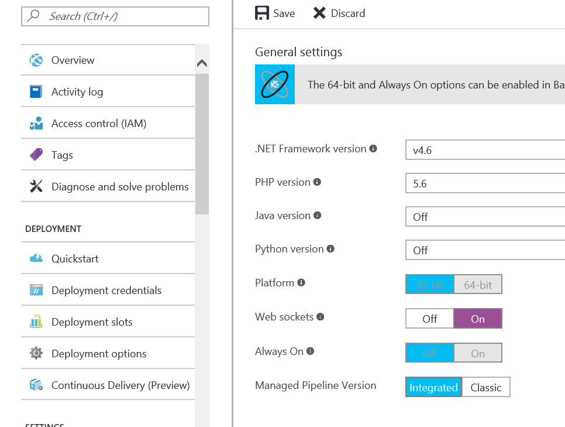
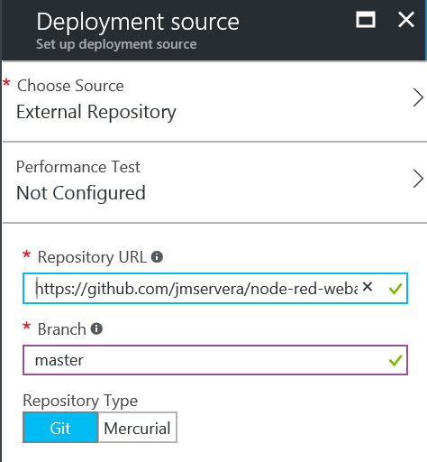

# node-red-webapp
A webapp wrapper for running node-red in an Azure Web App.
To use it just:

1. Create an Azure Web App
1. Open the settings and activate **Web sockets**

    

    **Figure 1** Activate Web sockets
1. Configure the deployment options as an *External repository* pointing to https://github.com/jmservera/node-red-webapp.git

    

    **Figure 2** External Repository

Open your site and wait until it everything is deployed. It will come with some nodes preinstalled:

* UI
* Azure IoT Hub
* Cognitive Services
* Azure Storage (Blobs & Tables)
* DocumentDB
* Azure SQL

To secure this deployment and add an admin password edit the `settings.js` file.

> This project currently uses a workaround to avoid a small problem caused with `child_process.execFile`: it uses a fake npm.cmd that points to the real one.

